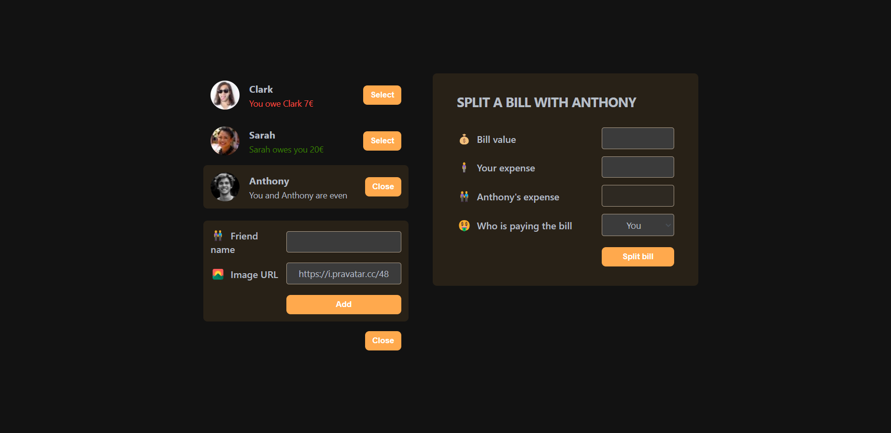

  # Eat-N-Split
  
  A React app that helps users split and keep track of their expenses with their friends. You can easily add new friends, record expenses, and settle debts effortlessly.
  
  
  
  ## Live Demo
  
  Check out the live demo [here](https://n1khilnick.github.io/eatNsplit/).
  
  ## Features
  
  - **User-Friendly Interface**: An intuitive and clean user interface makes it easy to manage your expenses and friends.[Not Responsive yet]
  - **Add New Friends**: Keep a record of your friends and their contact information.
  - **Expense Tracking**: Record expenses and specify who participated. The app will calculate each person's share.
  - **Real-Time Balances**: Instantly see who owes you money and who you owe.
  - **Settle Debts**: Easily settle debts with friends and keep a history of payments.
  
  ## Getting Started
  
  To get started with Eat-N-Split, follow these steps:
  
  1. Clone this repository to your local machine:
  
     ```bash
     git clone https://github.com/yourusername/eat-n-split.git
     ```
  
  1. Navigate to the project directory:
  
     ```bash
     cd eat-n-split
     ```
  
  1. Install the required dependencies:
  
     ```bash
     npm install
     ```
  
  1. Install the required dependencies:
  
     ```bash
     npm start
     ```
     
  ## Usage
  1. The app will automatically calculate how much each friend owes or is owed.
  1. Add your friends to the app by clicking on the "Add Friend" button.
  1. View your balances and settle debts conveniently.
  
  ## License
  This project is licensed under the MIT License - see the LICENSE file for details.
  
  
  1. Open your web browser and go to http://localhost:3000 to access Eat-N-Split locally.
